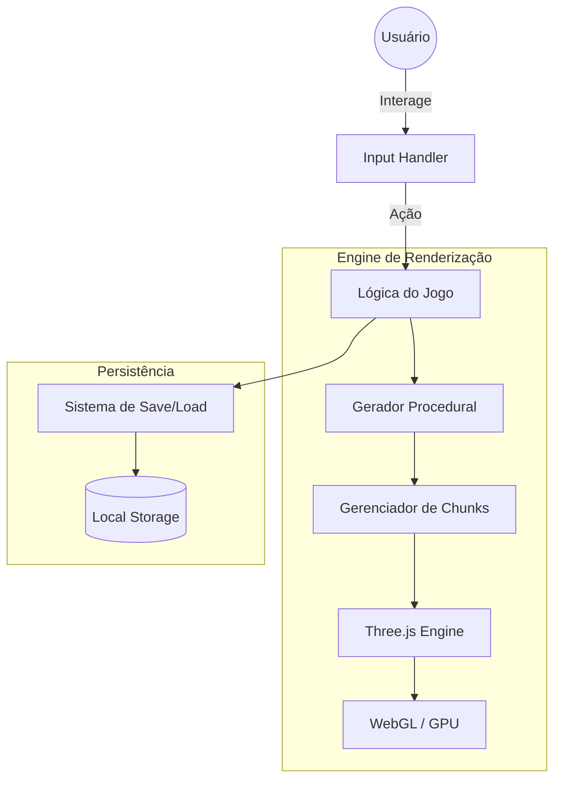

# Minecraft Three.js Clone

Um simulador de mundo voxel inspirado em Minecraft, desenvolvido para fins educacionais para demonstrar a criação de ambientes 3D complexos diretamente no navegador.

---

## 📖 Sobre o Projeto

O Minecraft Three.js Clone é um projeto experimental que explora a renderização de mundos procedurais utilizando a biblioteca Three.js. O objetivo principal é provar que é possível construir a mecânica fundamental de um jogo de voxel (como a geração de terreno, biomas e terraformação) sem a necessidade de escrever shaders customizados ou utilizar engines de jogo pesadas.

O projeto serve como um estudo de caso sobre otimização de renderização 3D na web, abordando conceitos de chunking para manter a performance mesmo com a expansão do mapa.

O público-alvo são desenvolvedores interessados em computação gráfica, matemática para jogos e entusiastas de JavaScript/Three.js.

---

## ✨ Funcionalidades

- **Geração Procedural de Mundo**: Criação automática de terrenos utilizando algoritmos que garantem a diversidade do mapa.
- **Sistema de Biomas**: Implementação de diferentes zonas ambientais com características visuais e de terreno distintas.
- **Extração de Recursos**: Sistema de mineração com detecção de blocos de carvão e ferro.
- **Terraformação**: Capacidade de modificar o ambiente em tempo real, adicionando ou removendo blocos de terra e pedra.
- **Otimização por Chunking**: Divisão do mundo em segmentos (chunks) para renderizar apenas a área visível, otimizando o uso de memória e CPU.
- **Persistência de Mundo**: Funcionalidade de salvar e carregar o progresso do jogador e as modificações feitas no terreno.

---

## 🏗 Arquitetura

A aplicação opera inteiramente no lado do cliente (Client-Side), utilizando a GPU do usuário através de WebGL para a renderização dos voxels.



---

## 📂 Estrutura do Projeto

```text
.
├── src
│   └── [Arquivos de Lógica] # Scripts de renderização, geração de mundo e controles
├── public                 # Assets, texturas e sons do jogo
├── index.html             # Ponto de entrada do HTML
├── style.css              # Estilizações básicas da interface (HUD)
├── vite.config.js          # Configuração do bundler Vite
└── package.json           # Dependências (Three.js) e scripts de build
```

---

## 🛠 Tecnologias Utilizadas

| Tecnologia | Finalidade |
|------------|------------|
| Three.js | Biblioteca principal para renderização 3D e WebGL |
| Vite | Ferramenta de build e servidor de desenvolvimento rápido |
| JavaScript | Linguagem de implementação da lógica do jogo |
| HTML5 / CSS3 | Estruturação da página e estilização do HUD |

---

## 📦 Dependências Principais

- **three**: A biblioteca fundamental que fornece as primitivas 3D, luzes, câmeras e a integração com WebGL.
- **vite**: Utilizado para otimizar o fluxo de desenvolvimento com Hot Module Replacement (HMR) e build eficiente.

---

## ⚙ Fluxo da Aplicação

Início $\rightarrow$ Geração do Chunk Inicial $\rightarrow$ Renderização do Cenário $\rightarrow$ Input do Usuário (Movimentação/Ação) $\rightarrow$ Atualização da Malha de Voxels $\rightarrow$ Redesenho do Frame $\rightarrow$ Save do Estado.

---

## 🚀 Como Executar

### Pré-requisitos

- Node.js instalado

---

### Clonando o projeto

```bash
git clone <url-do-repositorio>
cd Micecraft-Project/minecraft
```

---

### Instalando dependências

```bash
npm install
```

---

### Executando em modo de desenvolvimento

```bash
npm run dev
```
Acesse o link gerado pelo Vite (geralmente `http://localhost:5173`) para jogar no navegador.

---

## 🔍 Decisões Arquiteturais

- **Abstração de Shaders**: A decisão de não usar shaders customizados foi tomada para tornar o projeto mais acessível a iniciantes, provando que as funcionalidades básicas de Three.js são suficientes para criar um clone de Minecraft.
- **Implementação de Chunking**: Para evitar que o navegador travasse ao carregar mundos infinitos, o mundo foi dividido em chunks, permitindo que apenas os blocos próximos ao jogador sejam processados.
- **Voxel-Based Grid**: A utilização de uma grade de coordenadas inteiras simplifica a detecção de colisões e a manipulação de blocos.

---

## 💡 Boas Práticas Utilizadas

- **Otimização de Geometria**: Uso de buffers eficientes para renderizar múltiplos blocos com o menor impacto possível na performance.
- **Modularização de Lógica**: Separação entre a geração do terreno e a renderização visual.
- **Controle de Input**: Implementação de listeners de teclado e mouse para simular a experiência de primeira pessoa (FPS).

---

## 📚 Aprendizados

Ao analisar este projeto, é possível aprender sobre:
- O funcionamento básico de renderização 3D via WebGL.
- A aplicação de algoritmos de geração procedural de terrenos.
- A técnica de chunking para otimização de mundos abertos.
- A manipulação de matrizes de coordenadas para representação de voxels.

---

## 👨‍💻 Autor

[dgreenheck](https://github.com/dgreenheck) (Baseado no tutorial original)
